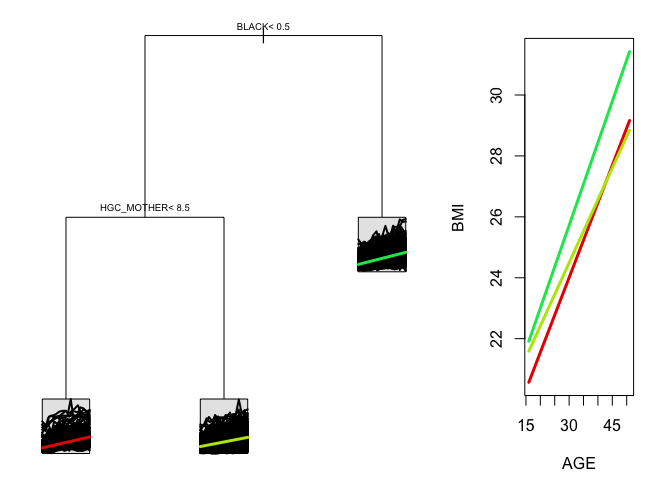

<!-- README.md is generated from README.Rmd. Please edit that file -->
splinetree
==========

This package allows users to create, visualize, and evaluate regression trees and random forests for longitudinal or functional data through a spline projection method first suggested by Yu and Lambert (1999).

Installation
------------

You can install splinetree from github with:

``` r
# install.packages("devtools")
devtools::install_github("anna-neufeld/splinetree")
```

Example
-------

``` r
library(splinetree)
#> Loading required package: rpart
#> Loading required package: nlme
#> Loading required package: splines
tree <- splineTree(BMI ~ HISP + WHITE + BLACK + HGC_MOTHER + SEX, BMI ~ AGE, "ID", nlsySample, degree = 1, intercept = FALSE, cp = 0.005)
stPlot(tree)
```



``` r
stPrint(tree)
#> n= 1000,  
#> 
#> node), split, n , coefficients 
#>       * denotes terminal node
#> 
#> 1) root, 1000,  (8.126419) 
#>   2) BLACK< 0.5, 707,  (7.553963) 
#>     4) HGC_MOTHER< 8.5, 157,  (8.595055)*
#>     5) HGC_MOTHER>=8.5, 550,  (7.256778)*
#>   3) BLACK>=0.5, 293,  (9.507738)*
projectedR2(tree)
#>            [,1]
#> [1,] 0.02645298
```
