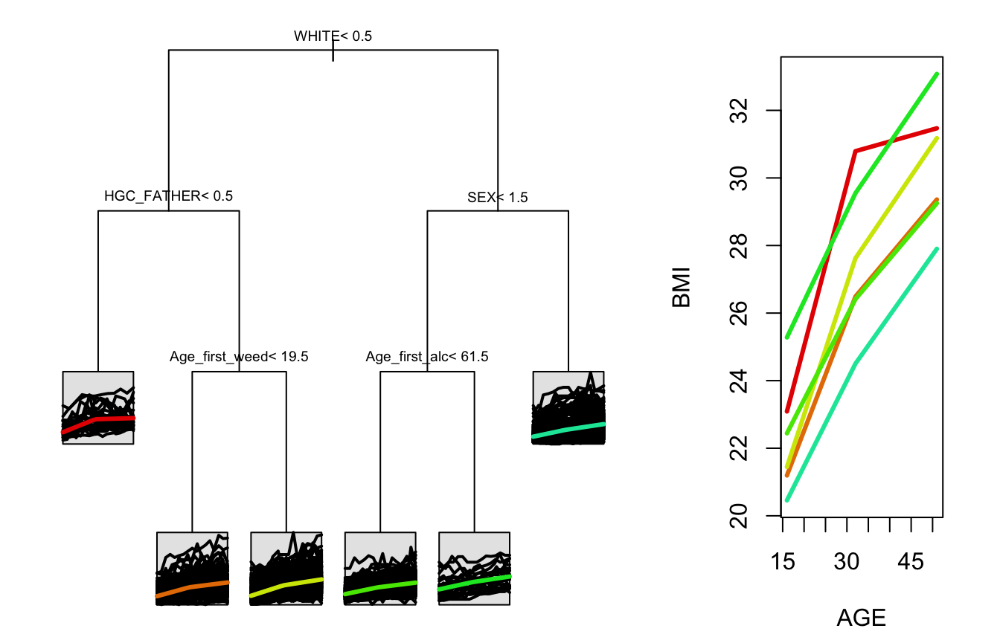

<!-- README.md is generated from README.Rmd. Please edit that file -->
splinetree
==========

[](https://travis-ci.org/https://travis-ci.org/anna-neufeld/splinetree)

This package allows users to create, visualize, and evaluate regression trees and random forests for longitudinal or functional data through a spline projection method first suggested by Yu and Lambert (1999).

Installation
------------

You can install splinetree from github with:

``` r
# install.packages("devtools")
devtools::install_github("anna-neufeld/splinetree")
```

Example Tree
------------

``` r
library(splinetree)
#> Loading required package: rpart
#> Loading required package: nlme
#> Loading required package: splines
tree1 <- splineTree(~HISP+WHITE+BLACK+HGC_MOTHER+HGC_FATHER+SEX+Num_sibs, 
        BMI ~ AGE, "ID", nlsySample, degree = 1, df=2, intercept = FALSE, cp = 0.005)
stPrint(tree1)
#> n= 1000,  
#> 
#> node), split, n , coefficients 
#>       * denotes terminal node
#> 
#> 1) root, 1000,  (4.961796, 8.091247) 
#>   2) WHITE< 0.5, 505,  (5.882807, 9.006190)*
#>   3) WHITE>=0.5, 495,  (4.022179, 7.157821) 
#>     6) HGC_FATHER< 8.5, 78,  (5.198284, 8.642817)*
#>     7) HGC_FATHER>=8.5, 417,  (3.802188, 6.880053)*
```

``` r
stPlot(tree)
```



Example Forest
--------------

``` r
set.seed(1234)
forest1 <- splineForest(~HISP+WHITE+BLACK+HGC_MOTHER+HGC_FATHER+SEX+Num_sibs, 
        BMI ~ AGE, "ID", nlsySample, degree = 1, df=2, intercept = FALSE, ntree=50, prob=1/2)
#> [1] "Building Tree:"
#> [1] 1
#> [1] 2
#> [1] 3
#> [1] 4
#> [1] 5
#> [1] 6
#> [1] 7
#> [1] 8
#> [1] 9
#> [1] 10
#> [1] 11
#> [1] 12
#> [1] 13
#> [1] 14
#> [1] 15
#> [1] 16
#> [1] 17
#> [1] 18
#> [1] 19
#> [1] 20
#> [1] 21
#> [1] 22
#> [1] 23
#> [1] 24
#> [1] 25
#> [1] 26
#> [1] 27
#> [1] 28
#> [1] 29
#> [1] 30
#> [1] 31
#> [1] 32
#> [1] 33
#> [1] 34
#> [1] 35
#> [1] 36
#> [1] 37
#> [1] 38
#> [1] 39
#> [1] 40
#> [1] 41
#> [1] 42
#> [1] 43
#> [1] 44
#> [1] 45
#> [1] 46
#> [1] 47
#> [1] 48
#> [1] 49
#> [1] 50
varImps <- varImpCoeff(forest1)
#> [1] "working on tree"
#> [1] 1
#> [1] 2
#> [1] 3
#> [1] 4
#> [1] 5
#> [1] 6
#> [1] 7
#> [1] 8
#> [1] 9
#> [1] 10
#> [1] 11
#> [1] 12
#> [1] 13
#> [1] 14
#> [1] 15
#> [1] 16
#> [1] 17
#> [1] 18
#> [1] 19
#> [1] 20
#> [1] 21
#> [1] 22
#> [1] 23
#> [1] 24
#> [1] 25
#> [1] 26
#> [1] 27
#> [1] 28
#> [1] 29
#> [1] 30
#> [1] 31
#> [1] 32
#> [1] 33
#> [1] 34
#> [1] 35
#> [1] 36
#> [1] 37
#> [1] 38
#> [1] 39
#> [1] 40
#> [1] 41
#> [1] 42
#> [1] 43
#> [1] 44
#> [1] 45
#> [1] 46
#> [1] 47
#> [1] 48
#> [1] 49
#> [1] 50
plotImp(varImps[,3])
```


